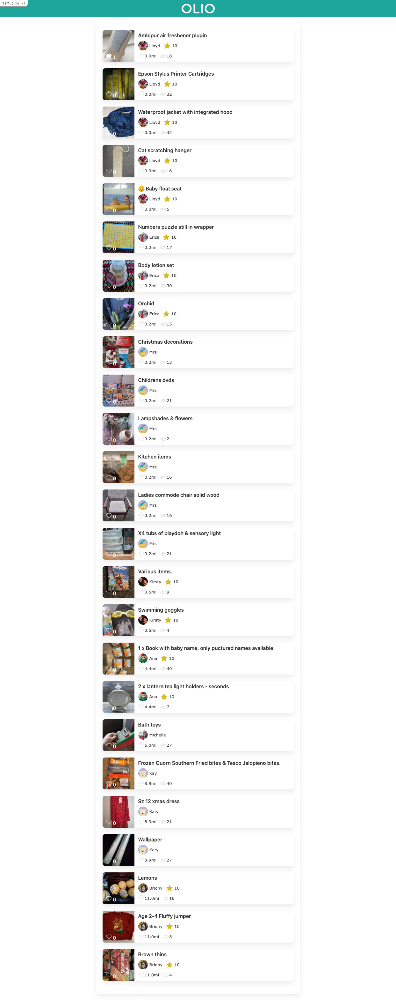

# README

This is an app that displays a list of items from users.

The displayed list of items comes from a JSON file in a S3 bucket. The JSON file contains a lot of properties about each item and user so I have used properties that are displayed on the OLIO app to mimic the look/feel of it.

### Running the app
1. Firstly, if you don't already have it, install Ruby. Here is a [helpful guide](https://www.ruby-lang.org/en/documentation/installation/) for this.
2. [Download the code](https://github.com/junolouise/itemlistings) for the app if you haven't already.
3. Open a terminal and type:
`gem install bundler`
4. Change into the app's directory from the terminal using
  `cd itemlistings` (or prefixed with the path to where you have saved it, if not the home directory)
5. Run `bin/setup` in the terminal
6. Run `rails server` in the terminal
7. Open your browser of choice and go to `localhost:3000`

